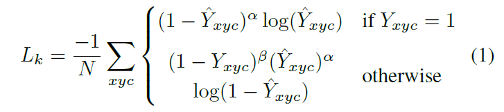
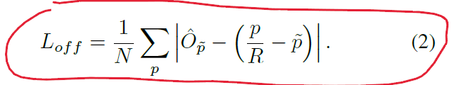
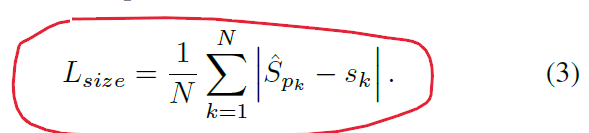
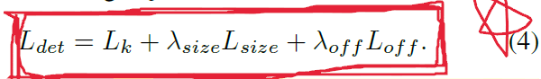
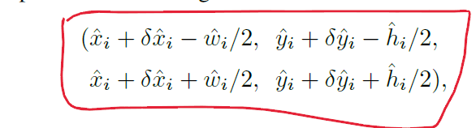

## CenterNet: Objects as Points

对目标bbox的检测转化为对一个点的检测，主要包含的有中心点和偏移，尺寸等。

### 核心思想

去除anchor-based的复杂设计，考虑到物体的语义信息，将整个物体用一个点来表示。同时兼顾速度和精度。

### 网络结构

在backbone的基础上增加了几个不同的解耦头。用于计算hm信息，offset信息，wh信息等。

其中hm就代表了类别。为降低计算量，hm的输出共用了一套卷积头。

全卷积设计。

### 损失函数

hm部分的Focal Loss函数，用于平衡前后景信息， 也代表了这个类比的一个置信度。

offset和wh部分使用的都是l1损失。

对于hm的损失函数：其中在代码中，高斯半径为6. 下采样倍数为4. Focal Loss的参数α和β分别是2和4，分别代表了容易和复杂的损失占比。最后的hm都是按照比例缩放后的那个尺寸。

对于offset loss: 中心点的损失： 只有当这个中心点有值的时候才会计算它对应的损失。

对于wh loss: CenterNet中仅仅计算wh，同样使用L1 Loss.

end-to-end的损失函数：

其中size和offset前面的权重分别是0.1和1

### 输出

直接输出像素值，根据偏移量，长宽信息得到bbox. 并且还可以预测其它信息比如深度信息，旋转信息等。只要增加相应的解耦头即可。

### 性能

兼顾mAP和速度。同时一套网络可以完成其它的任务，例如3d检测等。

FairMOT便是基于此做的。

