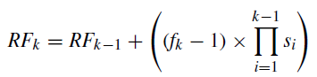

## A Simple and Efficient Network for Small Target Detection

提出了一种检测小目标的新backbone, 取得了tiny YOLOv3的速度和YOLOv3的精度。有更高的速度和精度提升。

有价值的点在于提出了使用空洞卷积来解决感受野的问题。

### 核心做法

1. 使用空洞卷积来扩大感受野，并且使用passthrough模块来将前后不同阶段的特征融合在一起，替代了下采样步骤，综合考虑了语义信息和位置信息。
2. 提出了passthrough模块增强小目标定位的准确性已经多尺度语义信息的融合，即将low level和high level给融合起来。这里不是采用简单的降采样，而是一种shuffle的形式将像素位置重新排布。2H * 2W *C --> H * W * 4C的形式来替代降采样操作，然后通过concatenate之后再使用1 * 1卷积得到比较小的map.
3. 多尺度特征融合。就是通过concatenate操作将各个输出特征给融合在一起。和之前的操作基本相同。

不同的模块之间都会有特征融合的操作，而融合的过程就是通过拼接后再通过1 * 1卷积降维来完成。

### 感受野的计算方法

公式:

其中RFk代表了在第k层得到的特征能够看到的一个感受野，默认初始输入层的感受野为1， 其中fk是卷积核的尺寸，si是第i层的步长。

