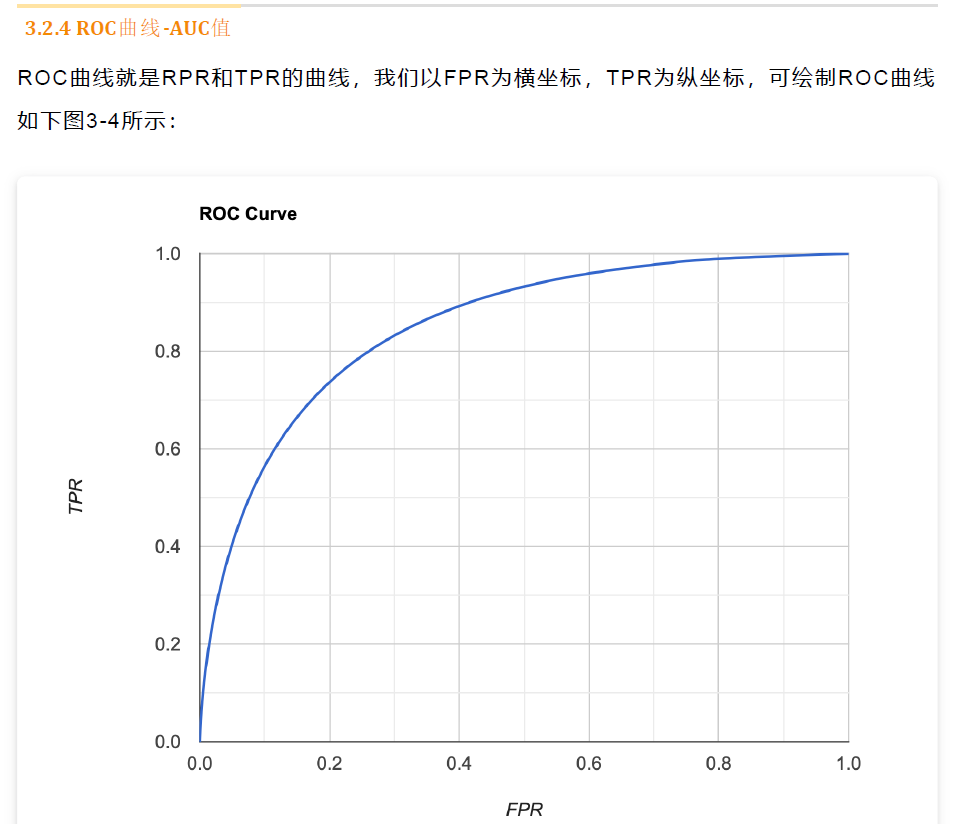

## 目标检测21年

### 路径

#### 传统方法

#### VJ DET

#### HOG DET

#### DPM

#### Fisher Vector

#### 深度学习方法

#### Anchor Based

Anchor-Based的方法的最大优势是为bbox的回归预测提供了先验参考，通过预设一组锚框，然后对浙西锚框进行偏移量的回归，从而达到比较高的召回率。但是这也带来了后期处理的一个NMS操作，比较耗时。

此外，Anchor由于自身携带了先验知识，比如潜在目标的大小，比例等，anchor自身的数量、ratio和长宽比对检测性能的影响都很大，对于anchor的设计是比较敏感的。

固定的大小的Anchor降低了检测器的普适性，导致不同的任务anchor都必须要重新设置长宽比和大小。

绝大多数的anchor实际上都是负样本，会带来极度的样本不平衡问题。

在训练过程中，在每一个位置都要计算这个anchor和GT的IoU以剔除掉某些不合格的anchor. 消耗资源。

##### 最早的两阶段算法

​	核心：从图像中生成region proposals  > 从region proposals生成最终的物体边框核类别预测。

> RCNN：Selective Proposals

> SPPNET：池化金字塔

> Fast RCNN：同时训练一个检测器和边框回归器

> Faster RCNN：RPN替代了Selective Search BBox

> FPN: 多尺度特征融合。

> Cascade RCNN：级联版本的RCNN 用于后面的预测

##### 一阶段算法

​	核心：不需要region proposal, 直接产生物体的类别概率和位置坐标，经过一个阶段即可直接得到最终的检测结果，速度更快。

> YOLOV1: 第一个真正意义上的单阶段检测器。开启了一种新的范式。

> YOLOV2~V5: 各种tricks和小的更新。小目标问题依然很难检测。提出了DarkNet Backbone模型

> SSD: 提出了Multi-reference和Multi-resolution的检测，在多尺度上进行预测。

> RetinaNet论文分析了一阶段网络训练的类别不平衡问题，提出了能够根据Loss大小自动调节权重的Focal loss, 主要用在置信度分类哪里。代替了标准的交叉熵损失函数。核心贡献是提出了Focal Loss.

#### Anchor Free

​	Anchor-Based的方法有众多的问题，比如计算量和超参数的设置，给损失的影响。因此开始转向那种通过预测关键点的形式来代替预测anchor的偏移量。

> CornerNet: 预测对象的左上角、右下角位置。第一个采用Heatmap和Embeddings的形式对对象位置进行估计。是Anchor Free的开创之作。CornerNet的最大特点是关注边缘和角点，忽略了对象本身语义最集中的区域。同时因为产生的是角点，角点之间的组合需要很多后处理工作，比如选取分数最高的点，offset微调，NMS。

> CenterNet-Triplets: 直接预测物体的中心点，然后通过中心点的特征来回归其它信息比如特征大小，3D位置，方向等信息。还提出了级联角点池化以及中心池化丰富角点位置的信息。CenterNet的本质问题： 如果物体自身离得比较近，那么在下采样的过程中就会将两个物体的中心点给叠加到一起了。当成一个GT来训练，导致漏检。

> FSAF：给FPN的anchorbased方法提供了一种ahchor-free分支，让每一个对象自动选择最合适的特征。anchor box可以自主学习得到。

> FCOS：基于全卷积的逐像素目标检测算法，实现了无锚点无proposal的完全free算法。提出了一种中心度的思想。在每一个特征层度会进行回归，计算CenterNess的heatmap， 分类特征等。感觉和CenterNet不同的点就在于CenterNet是固定下采样到4, 然后融合到一个heatmap中去做，完成了不同尺度的汇聚的过程，而FCOS则是在每一个特征level上做处理。

> SAPD：注意力偏差和特征选择部分anchor-free表现的不好，因此提出了对不同位置的样本进行权重分配。并进行权重加权。

> CenterNet：将目标视为点进行检测。

> DETR: 利用transformer进行检测。

### 常用的评价指标

#### 交并比

#### 准确率

#### 精度

#### 召回率

#### FPR

#### F1-Score

#### PR曲线-AP值

如果模型的精度很高，同时召回率也很高，那么就可以认定这个模型效果和性能就很好。AP值越大越好。平均精度。

#### ROC曲线-AUC值

显然真阳性TPR越高，假阳性FPR越低，模型的分类效果还是非常好的，反应在ROC曲线上就是ROC曲线下面的面积越大，模型性能越好。如果AUC越大，说明模型整体上对正样本的分类效果比较好。

#### mAP

平均精度均值，具体指的就是在不同的召回率下面精度均值，每一个要检测的类别都会绘制PR曲线，进而计算AP值，那么各个类别的AP值的均值就是mAP.

这个衡量的是模型在所有类别上的好坏，属于目标检测中一个最重要的指标。一般情况下，mAP针对的是整个数据集而言，而percision和recall是针对单张图片而言，AP针对的是某一个类别而言。

#### FPS

### 技术演变

#### 输入尺度演变

1. 区域候选
2. 回归
3. 多level特征融合
4. 多尺度和多分辨率

#### BBox回归

1. 初始情况下什么也没有
2. 从一个bbox到另外一个bbox
3. 从特征到bbox

#### 上下文特征提取

1. 提取局部特征
2. 提取全局特征
3. 上下文交互信息

