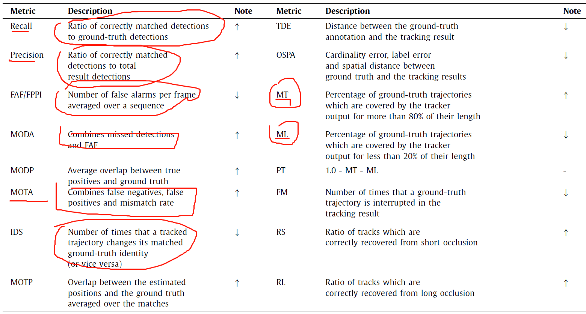
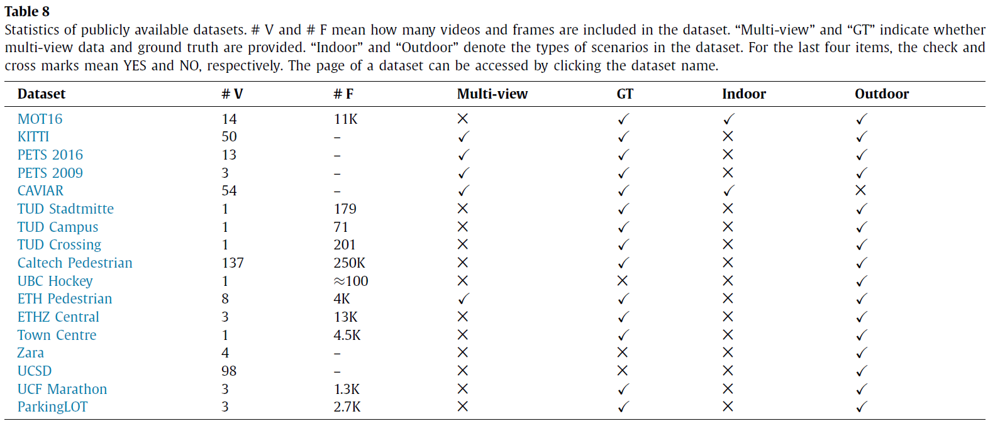

### 综述：Multiple object tracking: A literature review

### MOT问题概括

#### 问题建模

##### 多变量估计

MOT问题的本质可以看作是一个多变量估计问题，本质上就是给定一组图像序列，然后使用
$$
s_t^i代表了t帧时的第i个对象的状态(包括bbox, id等信息)，S_t = (s_t^1,s_t^2 \dots s_t^{M_t}) \\ 代表了第t帧M_t个对象的状态。s_{i_s:i_e}^i代表了第i个对象在s和e帧范围内的状态。\\
S_{1:t}=\{S_1,\dots S_2 \}代表了从1-t时间范围内所有的对象的状态集合。\\
同样也会存在一个O的集合，他们分别是在各个时刻对对象的观测。那么整个MOT过程就可以看作是一个求解最大后验估计的问题:\\
\hat S_{1:t} = argmax P(S_{1:t}|O_{1:t})
$$
各种各样的多目标跟踪问题实际上是对求解上述问题的一个具体实现。

数学上形式化推导过程略。

#### MOT的类别

##### 初始化方式

****

1. DBT：基于检测的跟踪

   得到对象的目标框然后与其对应的轨迹关联起来。给定一个序列，每一帧运行检测模型和运动模型得到目标对象假设，然后将这些假设和轨迹建立关联。

   * 目标检测模型往往是提前训练好的，也即意味着是多阶段模型。
   * 目标跟踪的结果非常依赖于目标检测的结果。

****

2. DFT：无检测跟踪

   手动标记，现实中可能使用的场景比较少，忽略。

##### 处理模式

核心是能否使用到未来的一些帧信息。

****

1. 在线处理

   Online模式检测器只能利用历史的帧信息，并且对于历史得到的数据并不能修改，一旦检测和跟踪之后，就只能在历史结果上演进，这种在实时场景下是一定需要的，但是在线不一定代表实时。

****

2. 离线处理

   可以看作是一种批处理，每一帧的结果都会从一个滑窗中综合计算得到最后的结果。联合了历史帧和未来帧多个帧的信息。

##### 输出类型

MOT属于判别类模型还是生成式模型，取决于选择的模型方法。

****

1. 随机跟踪 Stochastic tracking

   比如粒子滤波之类的。基本上还是比较偏向传统算法了，忽略。

****

2. 确定性跟踪

   每次运行跟踪得到结果所耗费的时间是常量级别的。

   比如TBD类型的方法所使用的匈牙利算法就是能够产生确定性结果的一种算法。

### MOT组件

MOT需要考虑的核心方法是如何在各个帧当中来测量对象之间的相似度。以及如何根据相似度值在跨越多个帧之间恢复对象的id信息，从而建立起轨迹。

并不是每一个跟踪器都需要用到所有的组件，一般情况下，外观模型，遮挡模型，运动模型以及推理模型会用到的更多一些，大多数tracker只用到了其中的若干个。

#### 外观模型 Appearence Model

外观模型是计算亲和性的一个重要方式。但MOT一般不会特别考虑这种模型，原因可能是已经融合到计算过程中了。外观模型中的两个关键组件时视觉特征提取和统计测量。（这些都可以看作是一些比较低级的特征)

****

1. 视觉表示: 刻画了对象的一些特征表达。

   * 利用一组不同特征来表示这个对象的视觉信息。

     1. 局部特征，包括了光流等，一般指的范围很小的特征，甚至达到像素级别的。

     2. 区域特征，从更广的范围内收集特征，分别包含了常数阶、一阶和二阶区域信息。阶数分别代表了这个区域内的像素值被计算了多少次。例如零阶就代表了颜色直方图，或者直接就是这种像素模式。

        一阶代表了利用特征的梯度信息，典型的就是HOG.

        二阶例如区域协方差矩阵？？？

     3. 一些其他的方法，例如深度估计之类的。

   总结:

   1. 颜色直方图: 一种高效和简洁的测量方法，但是没有办法得到对象的空间布局。
   2. 局部特征比较高效，但是对于遮挡类型不能很好处理。
   3. 梯度直方图HoG能刻画对象的形状并且也比较鲁棒但是计算效率比较低。同样还有协方差矩阵。
   4. 深度图需要额外的信息来获得深度估计。

****

2. 统计测量：刻画了两个观测对象之间的相似度。

   在基于视觉表达的基础上，统计测量计算两个观测对象之间的一个相似性。有的直接根据一种视觉特征计算出亲和性，另外则是会综合多种信息。、

   * 单一特征：NCC方法等。
   * 多特征综合：多方面的信息能够提供比较好的结果，但是问题是如何利用这些多阶段特征以及如何组合他们。
     * Boosting
     * 拼接等
     * 求和
     * 点积
     * 级联操作

#### 运动模型 Motion Model

运动模型的目的是捕获对象的动态行为，它估计了一个对象在未来帧中的潜在位置，因此能降低搜索空间大小。在大多数情况下，有一个很重要的先验知识是帧和帧之间对象的运动是连续平滑且缓慢的。

****

1. 线性模型

   线性模型的核心是任务运动是匀速的。

   * 速度平滑：通过强化连续帧中运动的一个平滑性特点。
   * 位置平滑：利用高斯估计建模，根据首位的位置gap使得各个点的位置满足高斯分布。
   * 加速度平滑：综合考虑速度和位置平滑性。

****

2. 非线性模型

   对于无规律的自由移动，线性模型基本上比较难把握。比如方向无规律改变时，线性模型基本上不能将两段tracklet建立起关联。？？？具体方法就没了？？？

#### 交互模型 Interactive Model

核心是捕获在运动过程中一个对象会施加给另外一个对象的影响，比如说在拥挤的情况下，一个对象可能要为另外一个对象让路而改变自己的轨迹等。

****

1. 社交力模型

   将目标都看作是一个个独立的个体，和其它个体，以及环境因素之间完全独立。

   * 个体力
     1. 保真性。一个对象在遇到目标时不会改变它的运动目的地。
     2. 连续性。一个对象不会突然改变它的运动动量，指的是不会立即改变它的速度和方向。
   * 群组力
     1. 吸引力。许多个个体一同运动，作为一个group， 他们之间的距离会相对比较近。
     2. 排斥力。虽然也是一个群组，但是群组内个体运动时需要保持一定的距离。
     3. 系统性。群组内对象运动速度和方向一致。

****

2. 拥挤运动模式模型

   拥挤模型一般适用于比较密集的场景中，原因是目标对象的密度是非常高的，并且非常小，并且对象和特征很具歧义性。在这种情况下建立拥挤运动模型是比较有效果的。

   拥挤模型和分为结构化和非结构化的特征，结构化的模式充分利用时空信息，而非结构化的模型特点则是使用运动的多模态。

   包括的方法：

   * ND tensors 投票
   * 隐式马尔科夫链
   * 相关主题模型
   * 场景结构信息

#### 排除模型 Exclusive Model

是一种约束模型，避免对象在物理空间的碰撞。基本出发点是两个不同的物体不可能在同一个空间占据相同的空间位置。

两种类型的约束，一种是检测级别的约束，即两个不同的检测框不能在同一帧中赋值给同一个对象。一种是轨迹级别的约束，即两条轨迹彼此间不能无线接近。

##### 检测级别的排他模型

****

1. Soft Modeling

   通过最小化一个损失来惩罚那些违反了这个规则的框，比如在一个轨迹中两个框都赋给了同一个目标。

   具体做法是通过图来完成的。这个需要的时候再去看吧。

****

2. Hard Modeling

   通过显式地约束来对检测级别的排他性建模。显式地引入了cannot links方法。

##### 轨迹级别的排他模型

轨迹级别的排他模型是用来惩罚那种两个很接近的框却有着不同的轨迹标签的情况。这时会压制一个轨迹label。

#### 遮挡模型

遮挡是MOT中最严峻的一个问题，它会造成ids和分段，不连续。

##### Part-to-whole

核心思想是纵使这个目标被遮挡了，只要部分还在，那么久还可以用这个部分代表目标的可见性。

常用的做法是将一个整体拆分为多个部分，然后基于多个部分计算他们之间的一个亲和度。在这种情况下，如果遮挡发生了，遮挡部分的亲和性部分就是比较低，跟踪器就会对那些没有被遮挡的部分给予更多的关注。

一般情况下，可以将一个对象划分为多个网格对象，或者是根据对象的特点划分为多个部分，例如人体等。

一般有两种处理方式，一种是通过选择搜索的方式，将遮挡的部分完全去掉，另外一种是通过soft加权的方式来计算轨迹之间的亲和性，即件各个部分分别对应计算他们之间的亲和性，最后通过一组可以学习的权重参数将他们加起来。

##### Hypothesize-and-test

通过假设候选框，然后测试这个候选框和当前观察到的对象的位置。

##### Buffer-and-recover 比较重要的一种方法

是一种离线方法，在遮挡发生时，将所有的观测状态都记录下来，并且记录在遮挡发生前的状态，当遮挡结束后，对象从缓存中加载遮挡发生前的状态然后再恢复。

即一般会保存若干帧的信息，然后再根据之前保存的信息来外推遮挡的轨迹，使得轨迹增长。

##### 其它

说的直接太概况了，直接带过。

#### 推理

##### 概率分布推理

将对象的状态表示为不确定性分布，在这种思想下，MOT的目标就是利用多种方法在已存在的观测对象的情况下来估计目标的概率分布。这种方法仅仅需要已存在的观测对象信息，即过去的现在的那些对象标注框，因此非常适合在线跟踪。在这种方法下马尔科夫链是一种最常用的方法。

两个重要层面：

1. 当前对象仅仅依赖于它之前的状态，而且只依赖最新的状态，马尔可夫的后无效性。
2. 各个观测之间互相独立。

对于一个对象当前的状态，则可以通过动态模型以及最新的一个状态计算出它的后验概率，然后利用更新步骤来更新厚颜概率。重复迭代这个过程就完成了目标框的预测。但是在实际中，对象的状态分布很难表示，需要一定近似估计方案来简化和实现。

###### 卡尔曼滤波 kalman filter DeepSort使用的方法

线性系统 + 高斯分布的对象状态分布

###### 扩展卡尔曼滤波 extended kalman filter

使用泰勒扩展完成对非线性运动的估计。

###### 例子滤波 optical filter

利用蒙特卡洛采样，通过一组有权重的粒子来建模隐式分布。

##### 确定性优化

本质上是找到一个最大的后验方案。这一类方法比较适合用于离线的目标跟踪，因为需要利用到一个时间窗口内的所有对象信息。

###### 二部图 Bipartite graph matching

采用二部图匹配方法进行。

###### 动态规划 Dynamic Programming

###### 最小耗费最大流网络流

一种图方法

###### 条件随机场 Conditionnal Random Field

###### MWIS 最大权重独立集

##### 对比

实际上确定性优化比概率分布推理更常用一些，虽然概率类方法提供了比较好的直观和完整的解决方案，但是通常很难推理。相反，能量最小化一般久可以获得比较好的结果。

### MOT评估方法

大多数模型依然是基于检测的，因此需要同时评估检测的性能和跟踪的性能。

##### 检测的评估

1. 准确性
2. 精度

##### 跟踪的评估

1. 准确性
   1. IDs
   2. MOTA
2. 精度
   1. MOTP
   2. TDE
   3. OSPA
3. 完整性
   1. MT
   2. RT
   3. ML
   4. FM
4. 鲁棒性
   1. RS, RL

### 常用数据集整理

其中最常用的行人跟踪数据集:

MOT系列:

MOT16 --> https://motchallenge.net/data/MOT16

