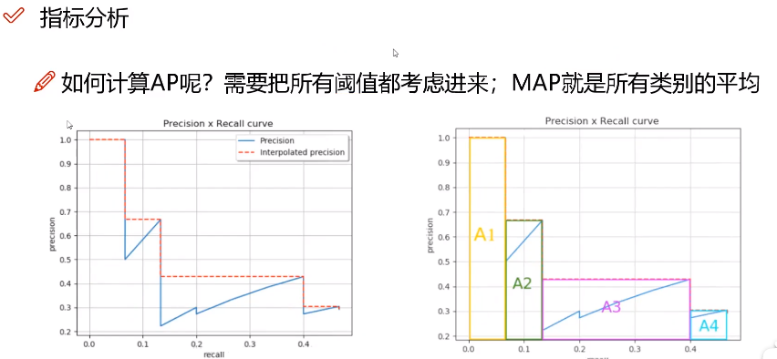

### 常见的性能指标

#### mAP. 代表了精度。

主要是综合地衡量一个检测效果，并不能单纯地看检测的精度和召回率。

精度：真阳性 / (真阳性 + 假阳性)。即认为这个判断器到底有多可靠。判断为真的里面

到底有多少是真的判断正确的。
$$
Precision = \frac{TP}{TP+FP}
$$

召回率: 真阳性 / (真阳性 + 假阴性)。即将所有的目标给判断找出来的比例。即看在所有的目标里面能判断正确多少个。因此分母是真正找出了的真阳性和自己判断错了的假阴性。
$$
Recall = \frac{TP}{TP+FN}
$$

$$
mAP = \sum
$$

每一个框都会对它进行分类，得到这个框对应类别的一个置信度。可以设置一系列阈值，从而找到一个精度最高和召回率最高的一个结果。

如果要求精度很高，即判断出来的框里面的结果必须要有很高的置信度才会参与计算，因此此时虽然得到的精度很高，但是在召回率一方面很多框直接没有检测到，因此召回率会下降。为了综合衡量这个结果，就是根据置信度的不断变换所对应的PR图，计算这个PR曲线能够围成的面积。这个面积就是AP值。将所有的对象所有的类别计算最后得到一个平均即为mAP。

#### FPS. 代表了检测速度。

#### IOU 交并比

$$
IoU = \frac{重叠的部分InterArea}{全部面积总和UnionArea}
$$

分子一般都是指的是GT和预测之间的一个交集，而分母是并集。

### NMS

在预测的时候只需要取IoU最大的那个框。

