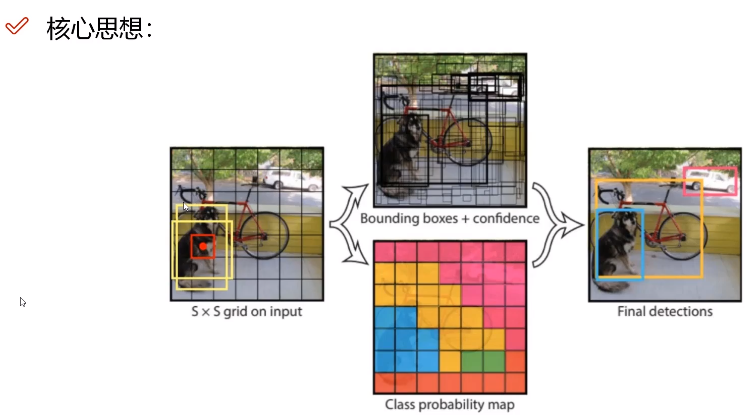
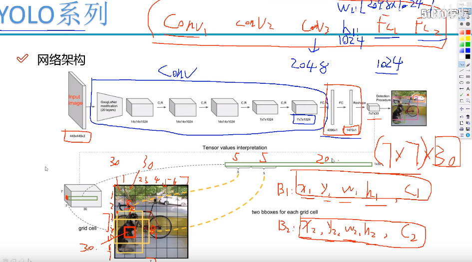
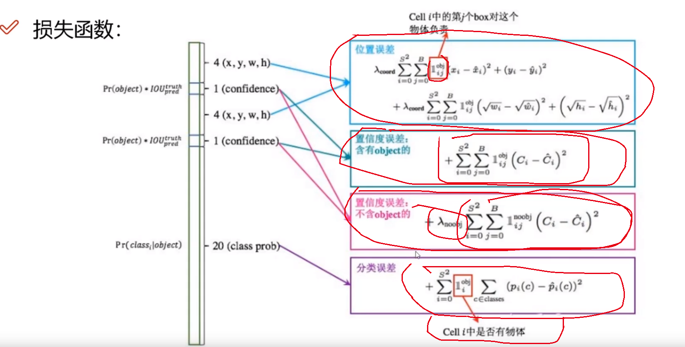

### V1版本

经典的One-Stage版本，只需要一次前向传播计算，就可以计算出各个部分的目标框，将检测问题直接转换为回归问题。只需要一次计算。

### 核心思想

1. 将整个图像或者特征图分为多个区域。称之为cell, 每个cell内只负责潜在对象中心点落在自己区域的那个对象的坐标信息。

2. 利用一种锚框值做先验基准，降低难度。

3. 利用回归来修正一个最合适的预测，即选出大于IoU阈值的那些候选框进行微调。

4. 需要根据置信度进行抑制那些候选框。

5. 每个框需要同时预测**x, y, w, h, c**. c代表了当前这个框所选出来的内容他到底是不是选中了一个对象。c就是置信度，代表了这个box里面是前景还是背景。

   

### 网络结构

输入固定: 因为需要得到固定长度的输入，前面的全连接层固定住了，得到7 * 7 * 1024的特征图 --> 4096fc隐藏层 --> 1470 * 1 --> 7 * 7 * 30。

其中每个cell都需要产生2个这样的(x1, y1, w, h, c)的预测框，框里面就简单考虑了横竖两种情况，然后后面是20个分类值。

总共对于每一个cell都会产生5 + 5 + 20个输出。

### 损失函数

#### 损失函数的种类

1. 位置误差的损失。计算各个位置的预测相对于真实gt的一个误差。
2. 每个框内的置信度预测，这个并不是一个二分类误差，这个会根据标签的实际情况对含有目标的和不含有目标的分类处理。
3. 一个分类误差。

#### 计算过程

1. 对位置预测的计算。首先是对S*S个cell, 对每个Cell的两个标注框只找到一个真正对这个目标进行负责的那个输出进行计算损失，**即某一个cell里面可能会标记有一个对象，然后找到和这个对象IoU最大的那个box来计算位置误差，否则就不计算位置误差**，即通过一个指示变量表示是否需要计算这个框， **然后再指示变量有效的情况下找到一个IoU最大的框计算**。在计算损失时进行了简单的归一化。
2. 计算置信度误差。如果某个cell中有一个对象标记，那么对应的box里面应该计算含有object的置信度，让其比较高一些，同时如果这个cell中不包括object， 那么就应该计算对应的不包括对象的损失，给其一个权重，减轻样本不均衡的情况。即无论这个cell中是否包含了对象，都应该按照类别计算对应的置信度权重。
3. 最后是一个分类误差。**分类误差同样也是需要根据实际的cell中是否有对象来标识的**，如果有这个对象，那么就会计算它对应的分类损失，否则就不会计算。

可以认为yolo的损失函数是各个相对独立的损失函数的一个加和，只要每个损失函数都做好自己的工作那么其它部分工作也全都做好了。

### V1存在的问题

1. 优点
   1. 非常的简单直接高效。速度非常快。
2. 缺点
   1. 每个Cell只预测一个类别，如果重叠了就无法解决。
   2. 小物体检测效果不是很好，而且长宽比锚框也比较单一和粗糙。