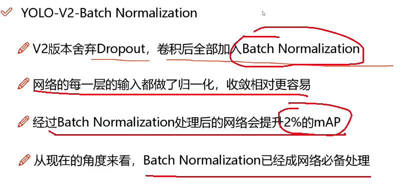
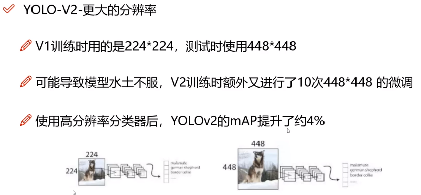
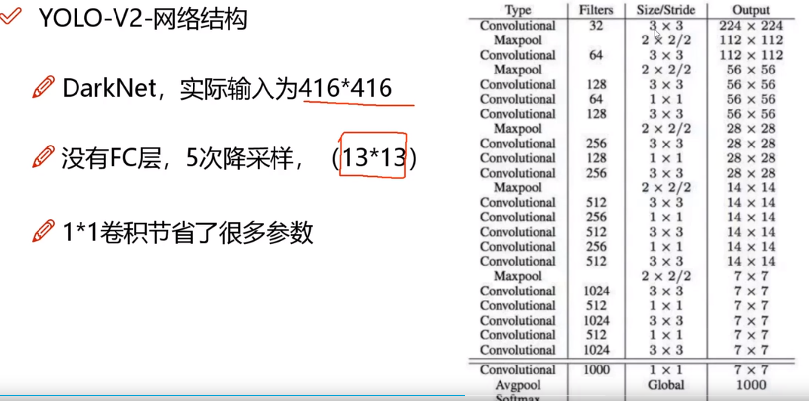
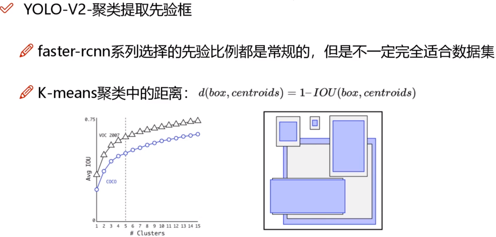
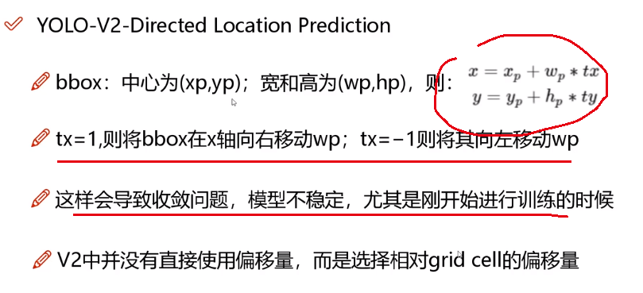
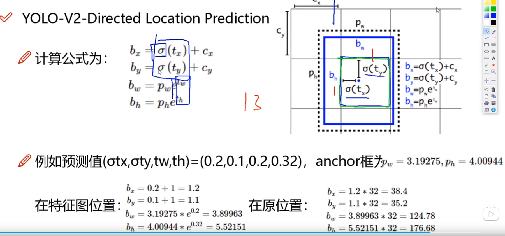

### V2版本

在V1版本上做了一些小的细节上的改变。但核心的和框架没有发生改变。

#### 改动

####  结构

主要是改变了网络的结构，使用了DarkNet. 然后使用了5次降采样，最后得到一个13 * 13的grid.

整个网络完全去掉了全连接层，同时大量使用了1 * 1卷积核。

#### 使用锚框

和faster-rcnn一样，开始使用先验框，但是并不是那种完全常规的先验框，而是采用聚类方法得到的先验框，从而使得能够比较好的适用测试集。**另外需要注意的就是在定义聚类距离的时候采用了IoU进行计算，利用IoU来代表距离。**经过实验发现k=5的时候效果最好。

显然anchor越多那么召回率就会越高。

#### 对位置的直接预测

**核心目的是为了防止在训练初期因为不稳当导致的偏移量过大，导致整个框偏离cell太远，训练不稳定。因此适用了相当于cell的偏移和sigmoid限制预测值，使其达到一个比较好的范围**。

最后的一层由于感受野太大了，小目标可能会丢失，因此在v2需要融合之前的特征。具体做法是先将前面某些层的特征拆分，然后再拼接加长融合成一个综合了不同感受野，不同尺寸目标检测能力的向量。

V2同时支持了多尺度的检测，采用迭代训练的方式来增强网络模型对不同尺寸大小目标的检测能力。

