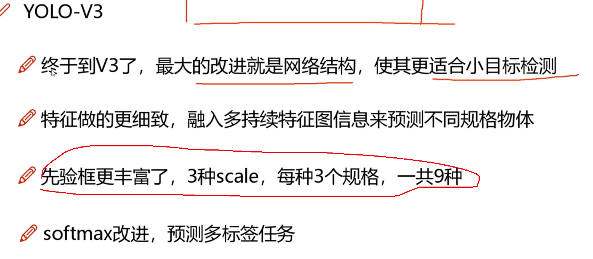
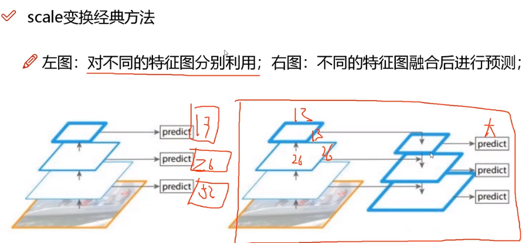
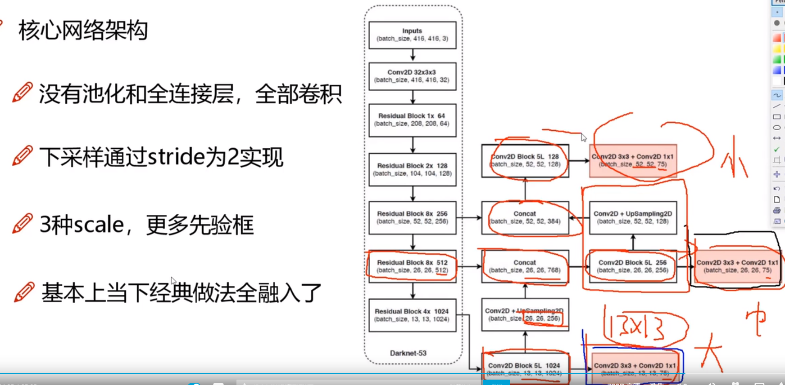
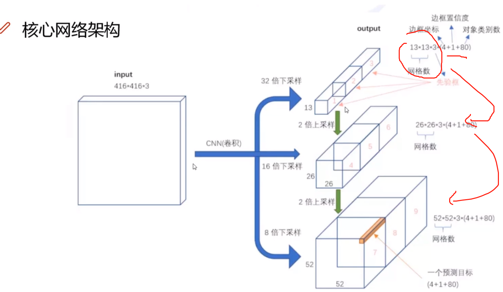
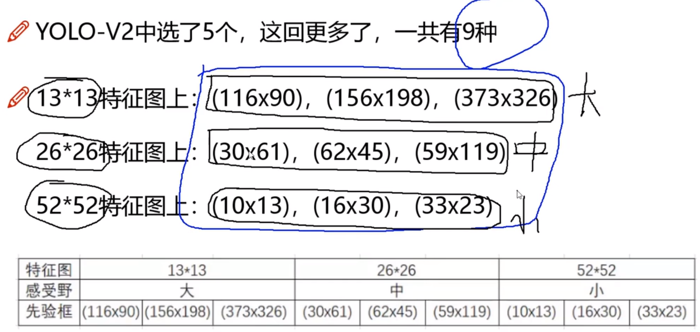

### V3版本

在网络结构上做了很多改进，使得更适合小目标检测。

### 改进

将softmax多分类改为多个二分类，从而解决多标签问题。另外考虑到了多尺度特征融合，即尺度大效率低但是能够很好地检测小目标物体，尺度大效率高但能很好检测大尺寸物体对小目标不怎么好。

### 多尺度融合

基本上和FPN一样的想法。特征金字塔，特征融合。

### 残差网络

在YOLOv3中加入了残差连接学习恒等映射。所谓的残差连接指的就是让残差模块自主学习选择那个特征。

除此之外，其它的核心网络架构中全部适用全卷积，没有了池化层和全连接层，下采样通过stride=2实现，引入了3种scale, 更多先验框。这个先验框是在各个scale中设置的，每个scale只负责检查合适的尺度。

### Softmax的替代

物体检测任务中可能会有一个物体有多个标签，并且采用logistic激活函数来完成，从这种角度来预测到底是不是这个类别。

