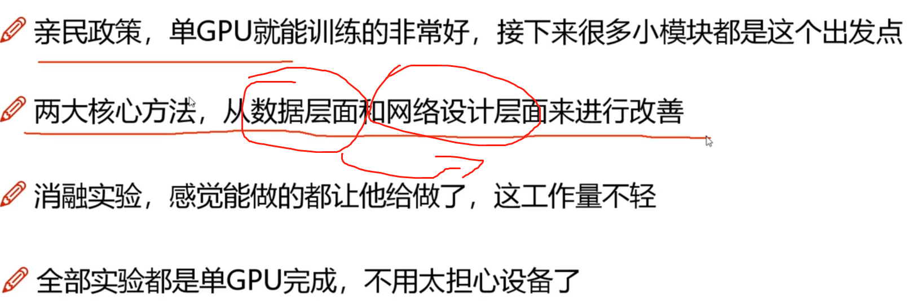
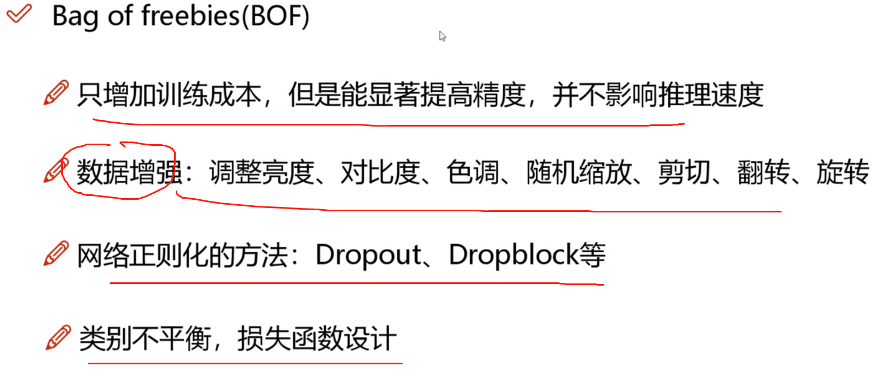
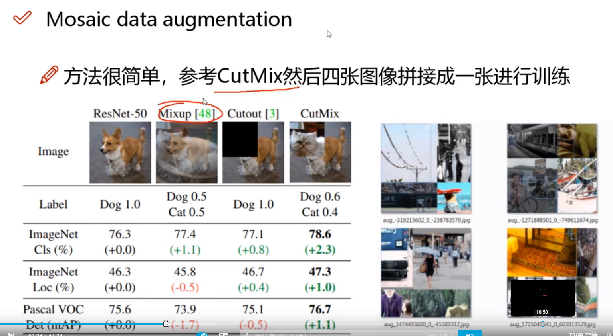
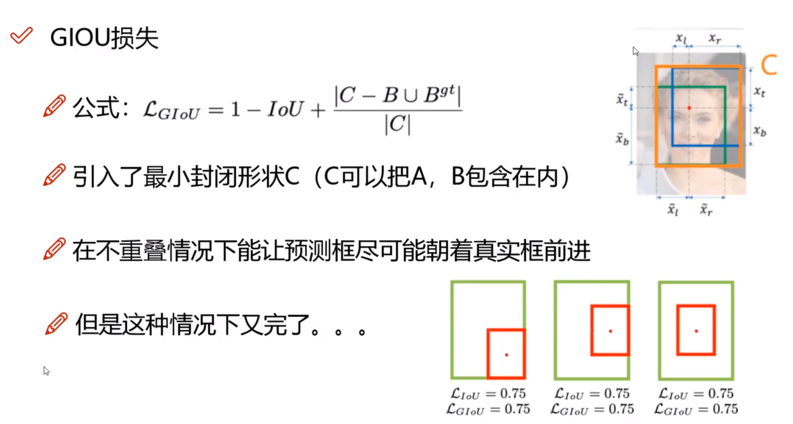
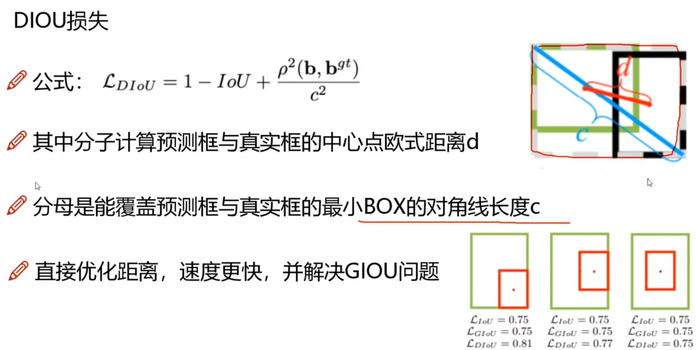
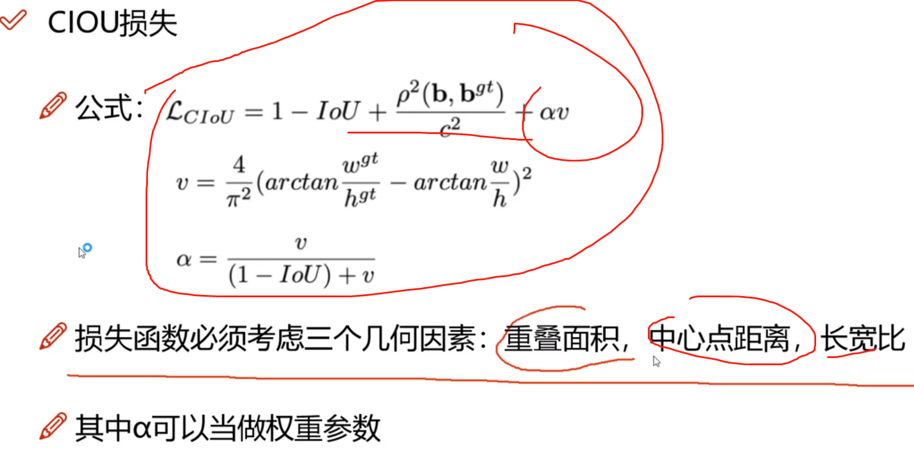

### V4 YOLO

 依然是堆砌细节。将各种优化细节给融合到自身当中去。

### 提升部分

### 数据增强：Bag of Freebies (BOF)

各种各样的细节部分。

#### 马赛克数据增强

将多张图拼接在一起，然后再进行检测。各自的图像进行的数据增强部分是没有变化的，但是可以利用马赛克机制将多个图融合在一起。

#### 噪音数据增强 + DropBlock

通过引入噪音点以及随机将某个区域全部给去除掉。

#### 标签平滑

### 损失函数部分

#### IoU损失

IoU损失很难能够从数据集合中反应出这个的交叉框好还是不好的问题。因为虽然数值一样，但是覆盖的情况却是不一样的。

#### GIOU

引入最小封闭形状，包围盒的意思出来了。C可以把AB包含在内部。在不重叠的情况下C可以把AB尽可能朝正确方向前进。

#### DIOU

#### CIOU

