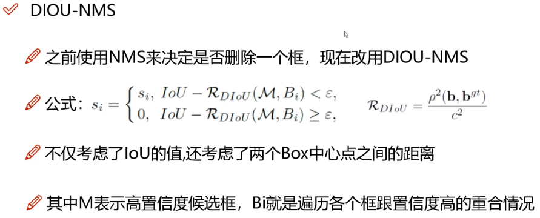
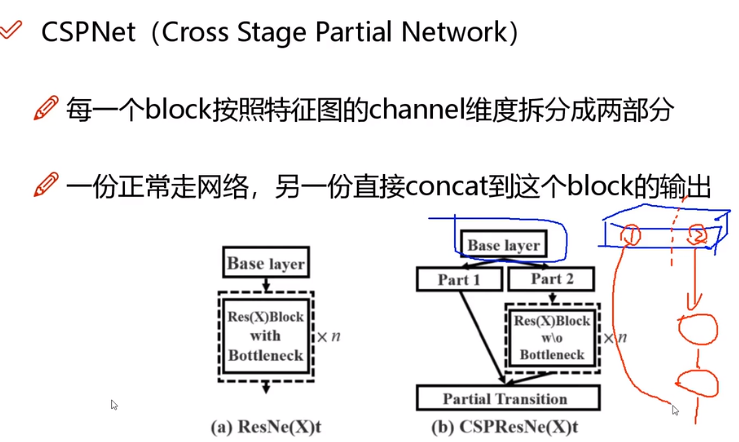
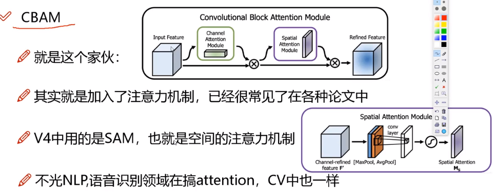
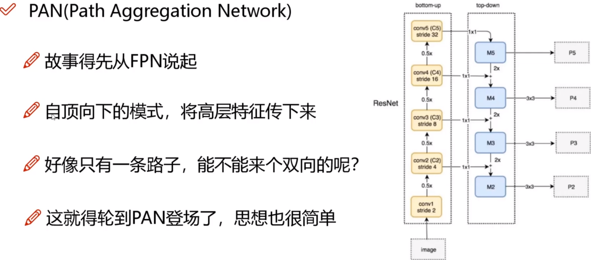
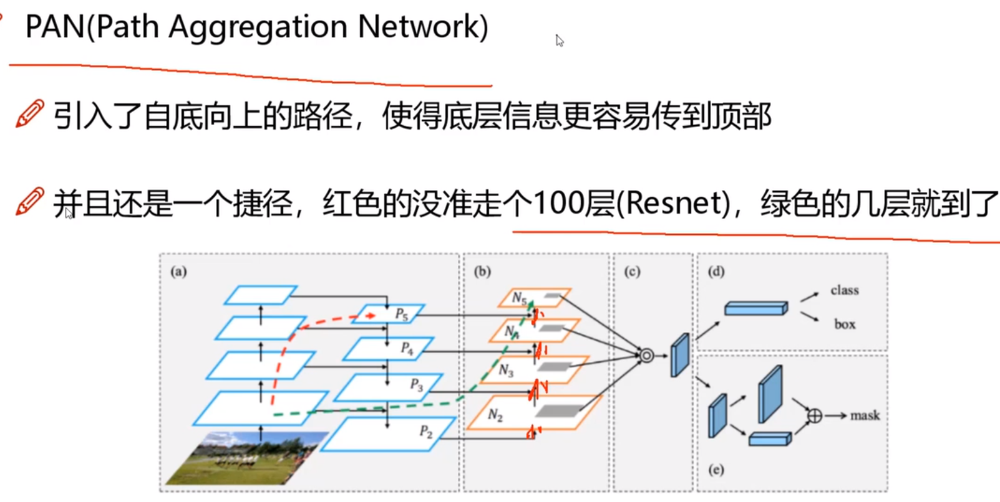
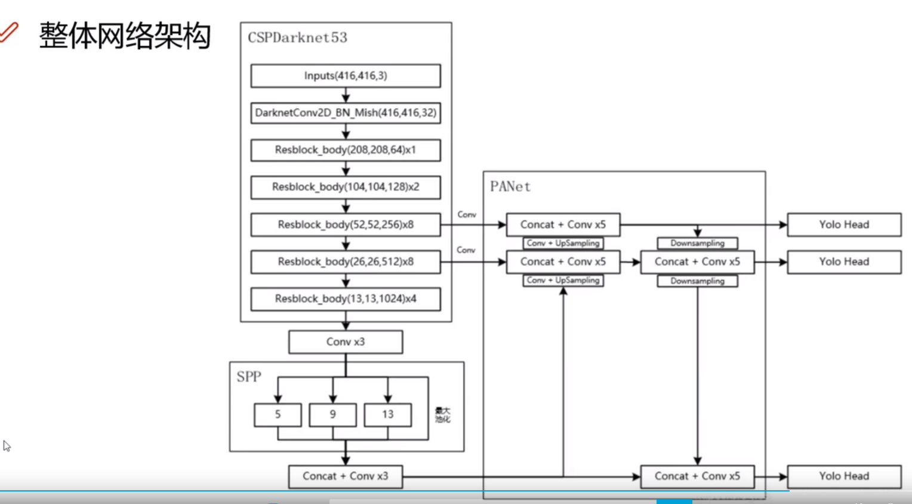
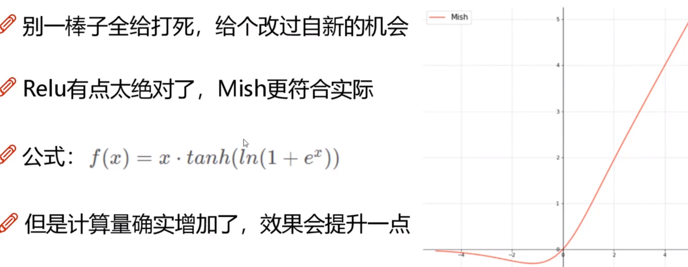

### V4 YOLO

 依然是堆砌细节。将各种优化细节给融合到自身当中去。

### 提升部分

### 数据增强：Bag of Freebies (BOF)

各种各样的细节部分。

#### 马赛克数据增强

将多张图拼接在一起，然后再进行检测。各自的图像进行的数据增强部分是没有变化的，但是可以利用马赛克机制将多个图融合在一起。

#### 噪音数据增强 + DropBlock

通过引入噪音点以及随机将某个区域全部给去除掉。

#### 标签平滑

### 损失函数部分

#### IoU损失

IoU损失很难能够从数据集合中反应出这个的交叉框好还是不好的问题。因为虽然数值一样，但是覆盖的情况却是不一样的。

#### GIOU

引入最小封闭形状，包围盒的意思出来了。C可以把AB包含在内部。在不重叠的情况下C可以把AB尽可能朝正确方向前进。

#### DIOU

#### CIOU

#### DIoU-NMS

将直接使用NMS决定是否删除一个框转换为使用DIoU-NMS来决定是否要删除一个框。NMS的核本质做法就是遍历，可以认为是一种贪心算法，在选择了一个合适的高置信度的框之后就将和这个框重叠的那些框统统去除。

#### Soft-NMS

将之前的直接删除掉的bbox转换为降低它的置信度，通过置信度来筛选值，这样在多个对象更多时候有一些机会获取到覆盖比较严重的区域能够被检测出来，而不是被丢弃。

### 网络结构的部分

#### SPPNet

V3中为了满足不同的输入大小，训练的时候要改变输入数据的大小，SPP其实就用最大池化来满足最终输入特征一致即可。即在某一个特征图输出上，使用不同的池化核得到不同的感受野的值，最后将它们拼接起来。形成一个融合了多个池化信息的混合特征图。

#### CSPNet

这个就有点像之前做的那个分组超分辨率模型了。称之为蒸馏，但是在这里是分组。一个分支保留了之前的原始信息，一部分正常的卷积操作。

#### CBAM

大量地使用了注意力模型，包括了空间的注意力和通道上的注意力，通道上的非常类似SeNET. 本质上是在空间上和通道上计算他们的权重。为了降低计算量，忽略了通道上的注意力，只包含了空间位置上的注意力。

在Yolov4中，直接将池化后再接入卷积一步替换为了步长大于2的卷积，这样做的好处是既可以增加感受野降低尺寸，计算量也不会那么大。称之为SAM。

#### PAN

从FPN --> PAN, 增加了从底层到高层的路径，组合两个双向的数据流向。

??? 感觉就是各自小实验，小trick. 

### 激活函数

#### Mish函数

和gelu函数差不多，都不会出现那种很极端的拐点。

